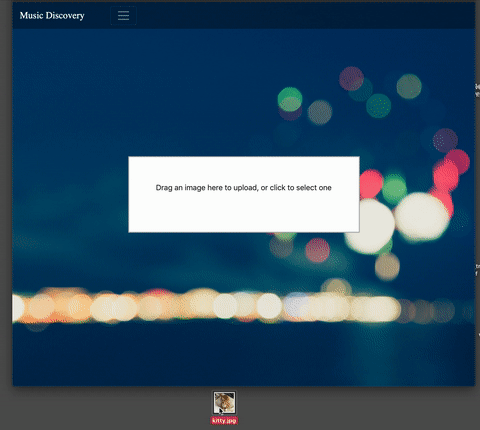

# Music Discoveory

Use images to discover new music on Spotify.  
This will uses Google Vision API to identify a related word to an image, and retrieves a playlist from Spotify using that word.

### Demo

## Built With
* HTML/CSS
* [Bootstrap 4.1.0](https://getbootstrap.com/)
* [EJS](https://ejs.co/)
* [Node 10.15.3](https://nodejs.org/en/about/)
* [Express](https://expressjs.com/)

### Requirements

* [Multer](https://github.com/expressjs/multer) - Middleware for uploading files
* [DropzoneJS](https://www.dropzonejs.com/) - For drag and drop file uploads
* [request](https://github.com/request/request) - For HTTP requests
* [Spotify-Web-Api-Node](https://github.com/thelinmichael/spotify-web-api-node) - Node wrapper for Spotify API
* [Google Cloud Vision API: Node.js Client](https://github.com/googleapis/nodejs-vision#readme) - Gcloud Vision
* [GCloud SDK](https://cloud.google.com/sdk/) - If you want to run locally

## Installing (For running locally)

To run locally you will need to:  

*  Get Spotify API keys from [Spotify's dashboard](https://developer.spotify.com/dashboard/login)  
*  Install Gcloud SDK and set up your project to use Google Vision API
   *  [Google Cloud SDK](https://cloud.google.com/sdk/docs/quickstarts)

Then

*  `npm install`

## Running Locally

`cd` into cloned directory, open quickStart.sh, and replace with your Spotify API keys, and path to Google Cloud Vision credential JSON file.

*  `./quickStart.sh`
*  Open `Localhost:8080` in your browser

### Deployment

Deployment coming soon

## License

This project is licensed under the MIT License - see the [LICENSE.md](LICENSE.md) file for details